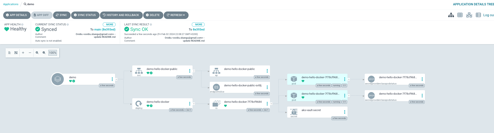

# Terraform Azure + ArgoCD k8s

Purpose of this repo is to help me deploy Kubernetes and all it's related resources in Azure Cloud.

### `workspaces/stack_env`

- This contains all the necessary configs for deploying the following resources: 
  - Resource Group
  - Network
  - 2 subnets
  - Azure container registry

### `workspaces/stack_aks_cosmo`

- This contains all the necessary configs for deploying the following resources:
  - Azure Kubernetes Service, deployed in custom network and custom subnet for the nodes.
  - Identity policies for:
    - Kubelet to pull images from ACR
    - AKS to be able to create networking resources (e.g load balancer) in the defined subnet.
  - Azure key Vault
  - CosmosDB + it's db endpoint created as a secret in the vault ( will be mounted to the pods as volume )
    
    Note: If very first time stack create with your AD identity the above key creation may fail, manual permissions in the vault may be required to continue. 

### Steps to create all the resources

### `1. environment stack create`

```bash
cd terraform/environments/dev/

terraform init

terraform plan

terraform apply
```

### `2. stack aks/cosmos/vault create`

```bash
cd terraform/projects/demo

terraform init

terraform plan

terraform apply
```

### K8s steps

### `Install ArgoCD`
```bash
cd k8s/argocd/aks

terraform init

terraform play

terraform apply
```
Verify if argo has been installed with `kubectl get all -n argocd`

Get initial argo pass: 

`kubectl get secret -n argocd argocd-initial-admin-secret -o json | jq .data.password -r | base64 -d`

PortForward: `kubectl port-forward service/argocd-server 4000:80 -n argocd`

Access ArgoCD `localhost:4000` in your browser of choice.

### `Install Azure secrets store CSI through helm.`

```bash
cd k8s/secrets-store

terraform init

terraform plan

terraform apply
```

### `Create App to ArgoCD`

This app will deploy the following [helm chart](https://github.com/ovisb/hello_docker_helm) through ArgoCD

Steps
```bash
cd k8s/argocd/apps/hello-docker

kubectl apply -f 'hello-docker-app.yaml'
```

`If all is good it should look like in the bellow screenshot:`



`Pick random pod and check if 'COSMOSDB_ENDPOINT' secret key value is present `

```bash
kubectl exec -it pod/demo-hello-docker-7f78cf9684-mbvxn -n dev -- printenv | grep "COSMOS"
                 
COSMOSDB_ENDPOINT=https://demo-cosmos-db-dev-25001.documents.azure.com:443/
```
